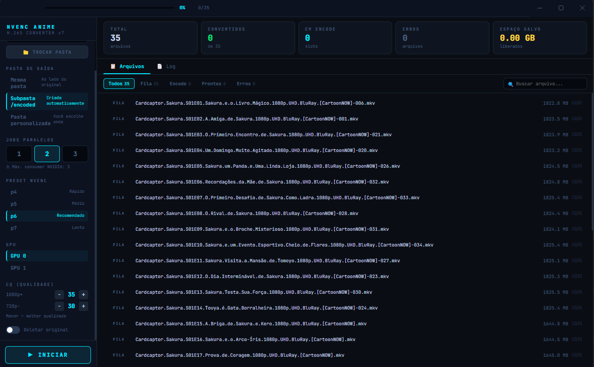
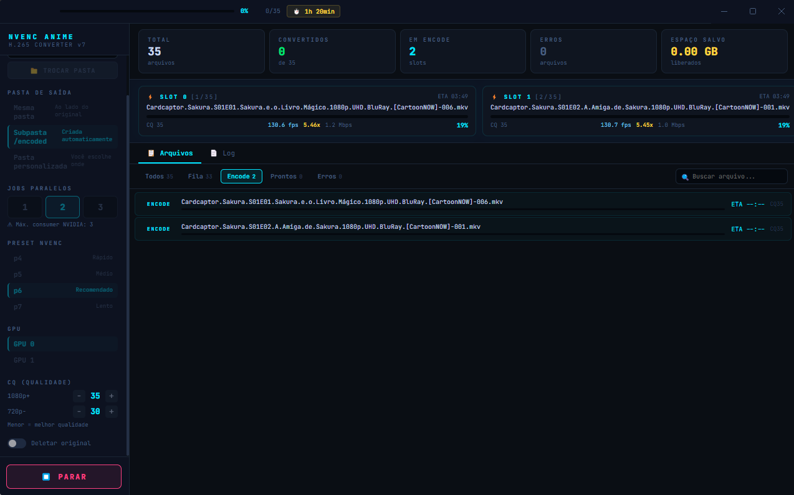
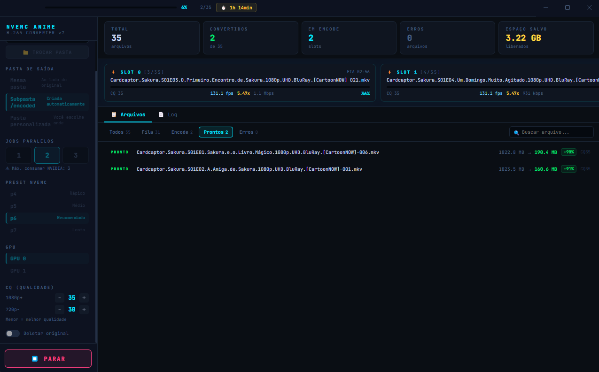

# NVENC Anime Converter — GUI v6

Interface gráfica Electron para conversão de anime em H.265 com GPU NVIDIA.

### Tela Inicial

### Tela de processamento

### Tela Final


## Requisitos

- Windows 10/11
- Node.js 18+ → https://nodejs.org
- ffmpeg + ffprobe no PATH → https://ffmpeg.org/download.html
- GPU NVIDIA com suporte NVENC (GTX 900+ / RTX)

## Instalação

```bash
# 1. Instalar dependências (apenas uma vez)
npm install

# 2. Rodar o app
npm start
```

## Build (gera .exe instalável)

```bash
npm run build
# Saída em: dist/
```

## Estrutura

```
nvenc-gui/
  main.js       ← Electron main process (pool de jobs ffmpeg)
  preload.js    ← Ponte IPC segura
  index.html    ← UI React (sem bundler)
  package.json
```

## Como usar

1. Clique em **TROCAR PASTA** ou no botão da tela inicial
2. Aguarde o scan automático (ffprobe lê metadados de cada arquivo)
3. Ajuste as configurações no painel esquerdo
4. Clique **▶ INICIAR**
5. Acompanhe o progresso em tempo real nas barras dos slots e na aba **Log**

## Configurações

| Setting | Descrição |
|---|---|
| Jobs paralelos | 1–3 conversões simultâneas (máx. 3 em GPUs consumer) |
| Preset | p4 (rápido) → p7 (lento/melhor compressão) |
| GPU | Índice da GPU (0 = principal) |
| CQ HD/SD | Qualidade por resolução — menor = melhor qualidade |
| Deletar original | Remove o arquivo fonte após conversão bem-sucedida |
