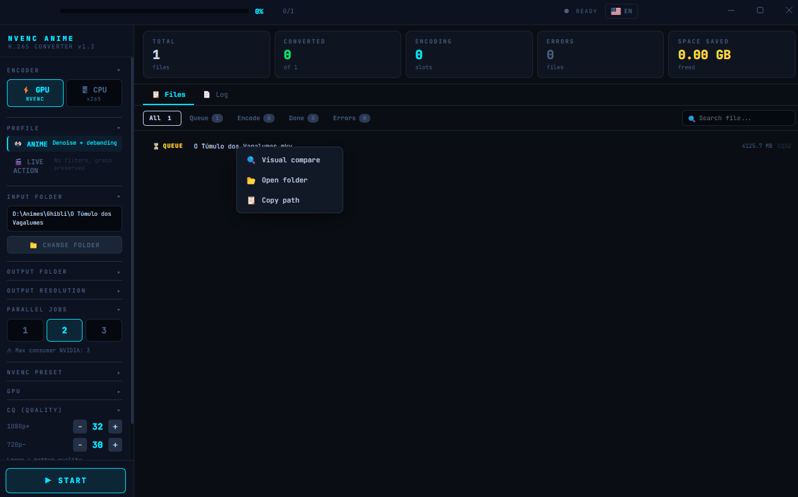
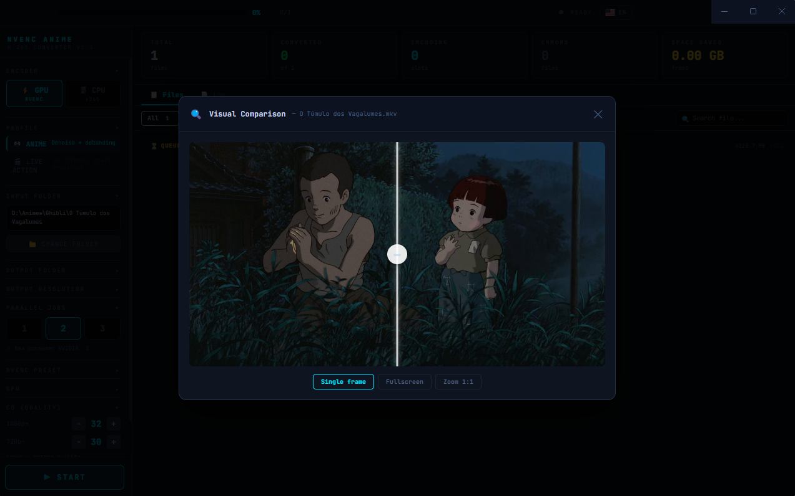
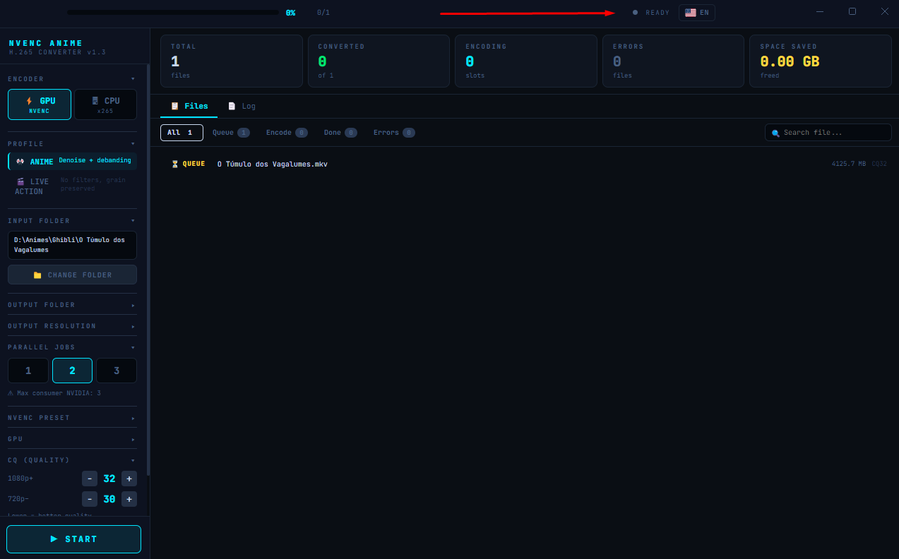

# NVENC Anime Converter — GUI v6

Electron GUI for anime conversion to H.265 using NVIDIA GPU.

### Home Screen

### Processing Screen

### Final Screen

### Visual Comparison


### English UI


## Requirements

- Windows 10/11
- Node.js 18+ → https://nodejs.org
- ffmpeg + ffprobe in PATH → https://ffmpeg.org/download.html
- NVIDIA GPU with NVENC support (GTX 900+ / RTX)

## Installation

```bash
# 1. Install dependencies (once only)
npm install

# 2. Run the app
npm start
```

## Build (generates installable .exe)

```bash
npm run build
# Output in: dist/
```

## Structure

```
nvenc-gui/
  main.js       ← Electron main process (ffmpeg job pool)
  preload.js    ← Secure IPC bridge
  index.html    ← React UI (no bundler)
  package.json
```

## How to use

1. Click **CHANGE FOLDER** or the button on the home screen
2. Wait for automatic scan (ffprobe reads metadata from each file)
3. Adjust settings in the left panel
4. Click **▶ START**
5. Follow real-time progress in the slot bars and **Log** tab

## Settings

| Setting | Description |
|---|---|
| Parallel jobs | 1–3 simultaneous conversions (max 3 on consumer GPUs) |
| Preset | p4 (fast) → p7 (slow/better compression) |
| GPU | GPU index (0 = primary) |
| CQ HD/SD | Quality by resolution — lower = better quality |
| Delete original | Removes source file after successful conversion |